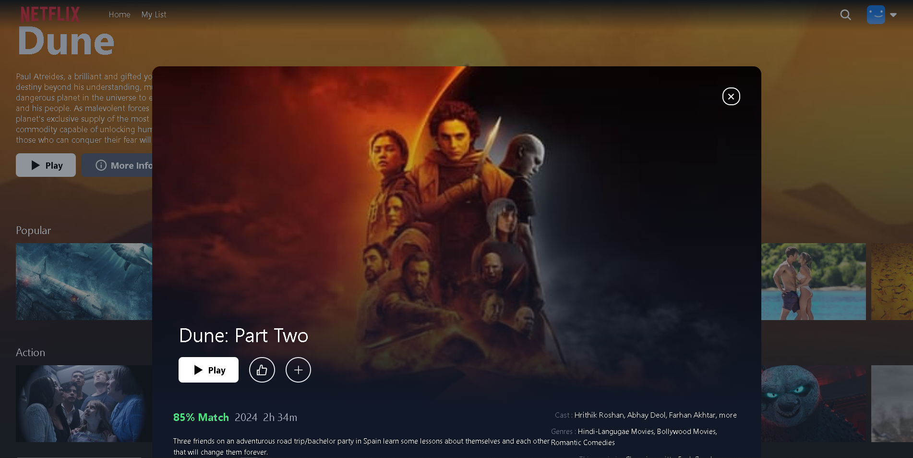

# Netflix Clone

Welcome to the Netflix Clone project! This project is a React.js application built with Tailwind CSS, offering a user-friendly interface inspired by Netflix. It integrates features like card transformations, calling TMDB API to fetch movie data, search functionality, and a watchlist feature. The application utilizes React Router for navigation and implements debouncing in the search feature for enhanced performance.

---

### Important Note : Before getting started.

I have made the both front end and backend of the website.

#### For Front and Back end -->

1.  Clone second branch of the this repo
2.  use this backend link https://github.com/akshayhallagade/netflix-clone-backend

#### For only Front(with no connected to backend)

1.  use master branch of this repo.

## Demo

Click on the image above to watch a demo showcasing the features and functionality of the Netflix Clone project.

Youtube Link -> https://youtu.be/jebi_lV81tE?si=QBy__jcEIml_Fg4F

Deployed URL --> https://netflix-clone-sepia-beta.vercel.app

## Features

- **User Interface**: The application provides a sleek and intuitive user interface, reminiscent of Netflix.
- **Card Transformations**: Experience smooth card transformations to enhance user interaction.
- **TMDB API Integration**: Utilizes the [TMDB API](https://www.themoviedb.org/documentation/api) to fetch movie data, including titles, descriptions, and images, for display on the webpage.
- **Search Functionality**: Users can search for movies using the search feature, which includes debouncing for improved performance.
- **Watchlist Feature**: Enables users to add movies to their watchlist for easy access to favorite titles.
- **React Router**: Utilizes [React Router](https://reactrouter.com/) for seamless navigation between different pages of the application.
- **Movie Details**: Users can view detailed information about a movie by clicking on its respective card.

## Technologies Used

- **React.js**: The project is built using [React.js](https://reactjs.org/), a popular JavaScript library for building user interfaces.
- **Tailwind CSS**: [Tailwind CSS](https://tailwindcss.com/) is used for styling the application, providing utility-first and responsive CSS classes.
- **TMDB API**: The TMDB API is utilized to fetch movie data dynamically.
- **Vercel**: Deployed the application using vercel.
- **Github Desktop,Github**: Managing the versions of done using github.

## Getting Started

### Important Note : Before getting started

I have made the both front end and backend of the website.

#### For only Front(with no connected to backend)

1.  use master branch of this repo.

#### For Front and Back end -->

1.  Clone second branch of this repo. -> **Backend connected branch**
2.  use this backend link https://github.com/akshayhallagade/netflix-clone-backend

### To run the Netflix Clone project locally:

1. Clone this repository to your local machine.
2. Navigate to the project directory in your terminal.
3. Install dependencies by running `npm install`.
4. Obtain an API key from TMDB API and add it to the appropriate configuration file.
5. Start the development server by running `npm start`.
6. Access the application in your web browser at `http://localhost:3000`.

## Pages Created

1. Sign up Page
2. Sign in Page
3. Homepage (Application Page)
4. Watchlist Page
5. Profiles page

## Library used

1. Tailwindcss
2. React Icons
3. Router Dom

## Language used

1. JSX
2. JavaScript
3. HTML
4. CSS

## Acknowledgments

- Special thanks to the creators of React.js, Tailwind CSS, TMDB API, and React Router for their invaluable tools and resources.

Feel free to explore the Netflix Clone project and enjoy the immersive movie browsing experience!
